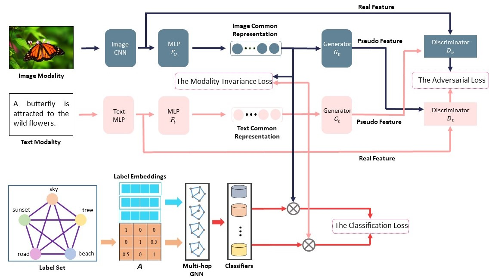
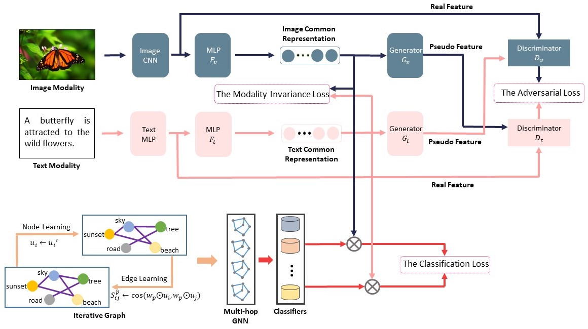

## Learning Graph Neural Networks with Dual Adversarial Networks for Cross-Modal Retrieval

This repository contains the author's implementation in PyTorch for the paper "Learning Graph Neural Networks with Dual Adversarial Networks for Cross-Modal Retrieval".


## Overview

> The structures of P-GNN  

<div align="center">
    
</div>
<p align = 'center'>
    <small>The overall structure of P-GNN.</small>
</p>

> The structures of I-GNN  

<div align="center">
    
</div>
<p align = 'center'>
    <small>The overall structure of I-GNN.</small>
</p>


## Dependencies

- Python (>=3.8)

- PyTorch (>=1.7.1)

- Scipy (>=1.5.2)

## Datasets
You can download the features of the datasets from:
 - MIRFlickr, 
 - NUS-WIDE(top-21 concepts),
 - MS-COCO
 
## Implementation

Here we provide the implementation of our proposed models, along with datasets. The repository is organised as follows:

 - `data/` contains the necessary dataset files for NUS-WIDE, MIRFlickr and MS-COCO;
 - `models.py` contains the implementation of the `DALGNN`;
 
 Finally, `main.py` puts all of the above together and can be used to execute a full training run on MIRFlcikr or NUS-WIDE or MS-COCO.

## Process
 - Place the datasets in `data/`
 - Set the experimental parameters in `main.py`.
 - Train a model:
 ```bash
 python main.py
```
 - Modify the parameter `EVAL = True` in `main.py` for evaluation:
  ```bash
 python main.py
```